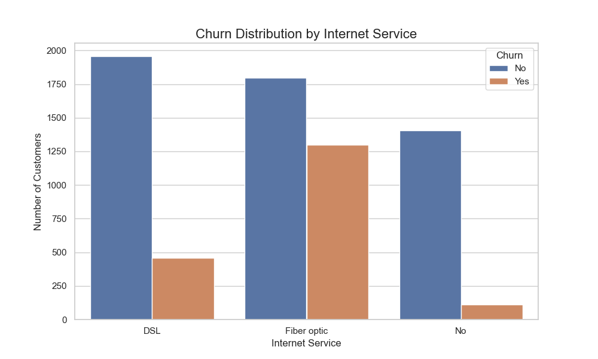

# Predicting Customer Churn for a Telecom Company

**Aayush Jha | Indian Statistical Institute (ISI)**

---


### Problem Statement

For a leading telecommunications provider, customer retention is a primary driver of revenue and market stability. This project aims to develop a machine learning model to proactively identify customers at high risk of churning. The goal is to move from a reactive to a predictive retention strategy by providing actionable insights into the key drivers of customer attrition.

----


### Dataset

The project utilizes the "Telco Customer Churn" dataset from Kaggle, provided by IBM.

* **Link:** [https://www.kaggle.com/datasets/blastchar/telco-customer-churn]


----


### Methodology & Key Steps

1.**Exploratory Data Analysis (EDA):** Investigated feature distributions and their relationship with customer churn.

2.**Data Preprocessing:** Handled categorical data using one-hot encoding and scaled numerical features.

3.**Model Building:** Developed two models to predict churn:

*A baseline Logistic Regression model for interpretability.

*A high-performance XGBoost Classifier.

4.**Model Evaluation:** Assessed models using Accuracy, Precision, Recall, F1-Score, and AUC-ROC.

### Key Findings & Visualizations
**Finding 1: Contract term is a major predictor of churn.** Customers on month-to-month contracts churn at a significantly higher rate than those on one or two-year contracts.

**Finding 2: Customers with Fiber Optic internet service are more likely to churn.** This may indicate issues with service quality or pricing for this specific offering.




**Finding 3: Key numerical drivers of churn include low tenure and high monthly charges.** The XGBoost model identified these as top predictors.

-----------

### Model Performance
The XGBoost Classifier significantly outperformed the Logistic Regression baseline across all key metrics, demonstrating its superior predictive power for this task.

| Model                    | Accuracy | Precision (class 1) | Recall (class 1) | F1-Score (class 1) | AUC-ROC
| ------------------------ | -------- | ------------------- | ---------------- | ------------------ |----------------
| Logistic Regression      | 0.8053   | 0.6515              | 0.5749           | 0.6108             |0.7318
| XGBoost Classifier       | 0.7783   | 0.5891              | 0.5481           | 0.5679             |0.7048


### Actionable Business Recommendations
* **Recommendation 1:** Develop targeted retention campaigns for customers on month-to-month contracts, offering incentives to upgrade to longer-term plans.

* **Recommendation 2:** Investigate potential service or pricing issues related to the Fiber Optic internet service to address the higher churn rate in that segment.

* **Recommendation 3:** Proactively engage with new customers (low tenure) to ensure a positive onboarding experience and build long-term loyalty.

----------


### How to Run

1.  Clone the repository:
    ```bash
    git clone [https://github.com/aayush-0131/Telco-Churn-Prediction-Analysis.git]
    ```

2.  Install the required dependencies:
    ```bash
    pip install -r requirements.txt
    ```

3.  Open and run the `Customer_Churn_Analysis.ipynb` Jupyter Notebook.
